# Milestone 2

#### Table of Contents
1. [Logistics](#Logistics)
2. [Idea Change in Milestone 2](#IdeaChange)
3. [New Proposal](#NewProposal)
   - [Prototype](#Prototype)
   - [UI Skeleton Webpage Screenshots](#Skeleton)

## Logistics
**Team Name**: Panda Express.js 

**Members**:
1. Kai-ling Peng
2. Martin Magsombol
3. Ryan Keng
4. Yidong Luo

**(Tentative) Tech**:
* Node.js (backend runtime environment)
* Express (backend framework)
* Firebase (database)

## Idea Change in Milestone 2
In Milestone 1, our team originally came up with 2 ideas. The first was *Next Page*, an app designed for musicians, which automatically turns the digital music sheet for the performer based on the notes played. The idea is interesting, yet eventually we all agree that we might run into technical difficulties when incorporating one API with another. Given the time constraint of the course project, we decided not to proceed with this idea. The second idea was *Music Visualizer*, an app designed for the deaf or hard of hearing, which visualizes music tracks and syncs vibrations to the beat of the music. Although the features seem simple to implement, we found that there are hardware limitations for vibration effects, which leaves us with one audio visualization feature for the app. With not much complexity left in this app idea, we decided to brainstorm another idea.

## New Proposal
**App Name**: *One Speaker* 
**Inspiration**: Minimizing noise can help establish a quality learning environment. Yet how do we encourage student participation at the same time? 
**Description**:
One Speaker will be a web app that minimizes noise from side conversations when an instructor is speaking. It would allow teachers to visualize noise levels in any of their classes while assigning participation points for their students.

This idea is different from the ones we proposed in milestone one in that the target user group is different, but it still deals with using sound to improve an experience. Our target user group shifted from musicians (Next Page) and the deaf community (Music Visualizer) to instructors of younger students (One Speaker). The app's functionality is different too, as this app facilitates noise level control and improves the experience of teaching in a noisy setting.

**Target Audience**: *Instructors in an elementary/middle school setting.*

### Prototype Overview
Creating an account or signing in:  
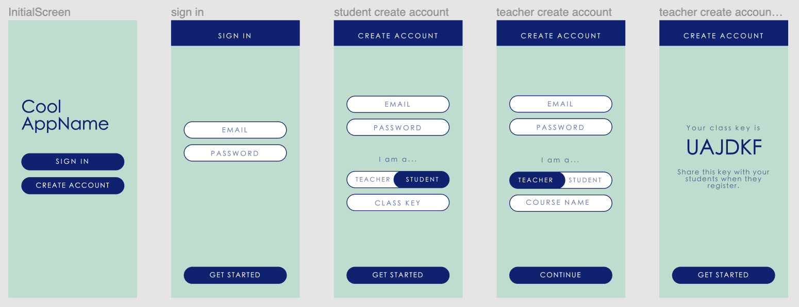 
Student account flow:  
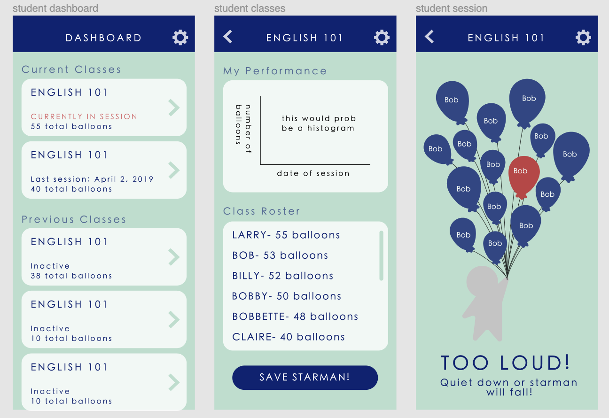 
Teacher account flow:  
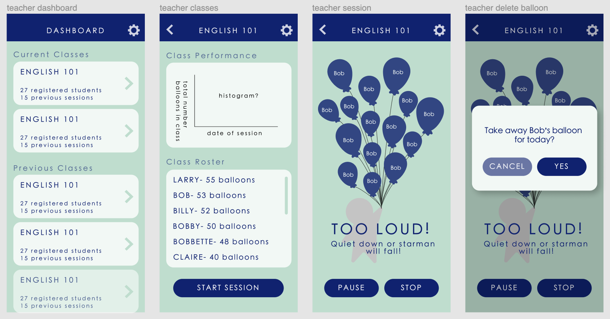 

### Getting Started
User is able to sign-in or create an account if they don't have one yet. 
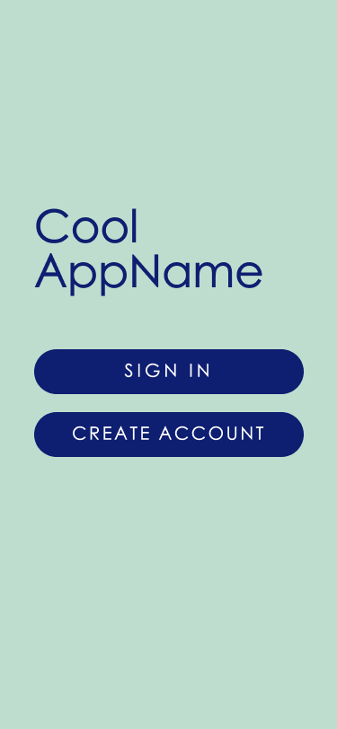 
User is able to input their account information to access their account. 
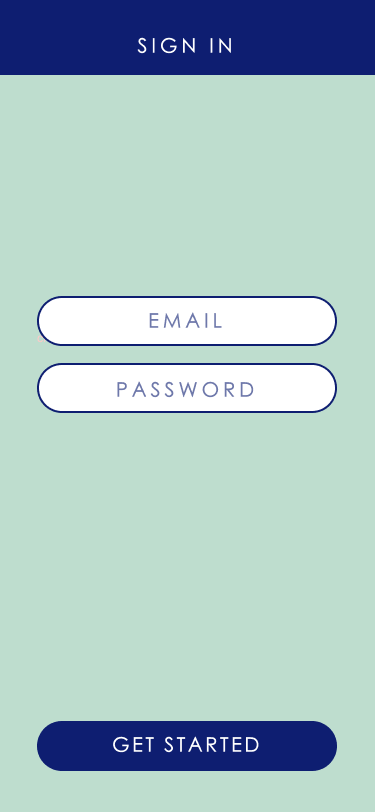 
User can toggle between Teacher and Student when creating account. 
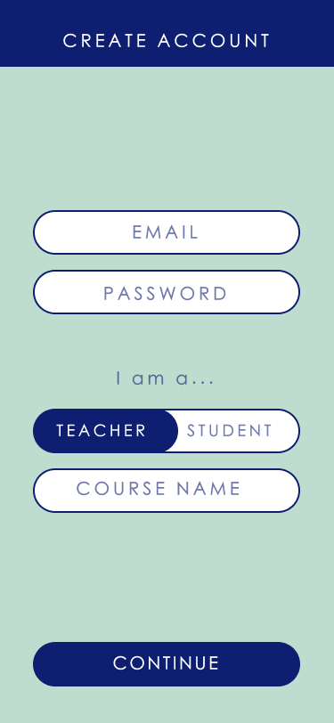 
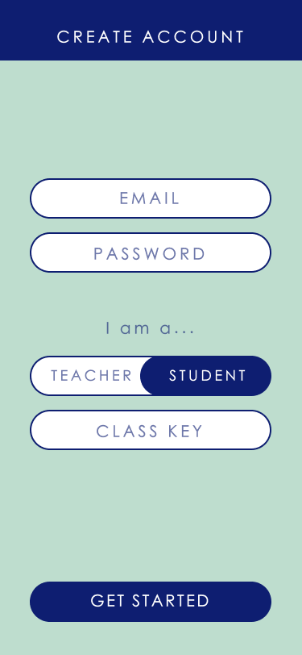 
If user creates a teacher account, a class key will be generated for students to register with. 
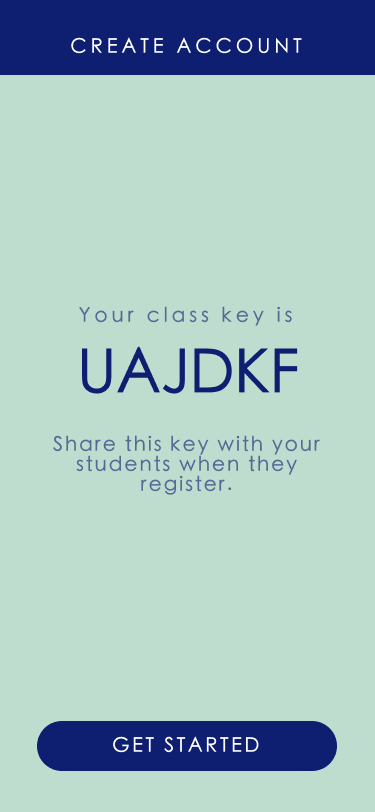 

#### Student View
Students have access to current and previous classes through the dashboard. 
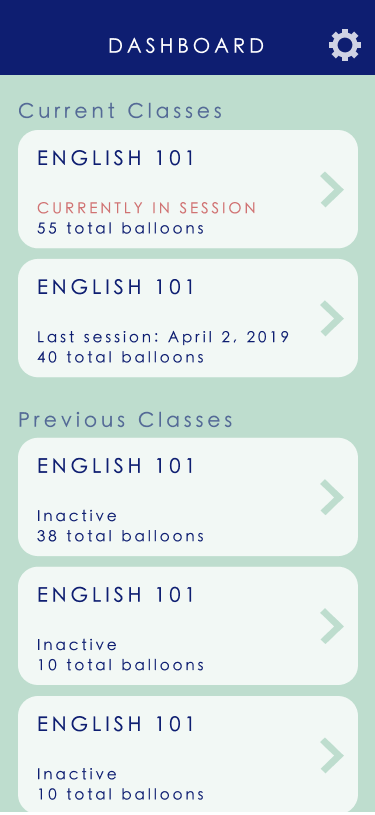 
Students can view their performance in each class and see how their peers are performing in class. 
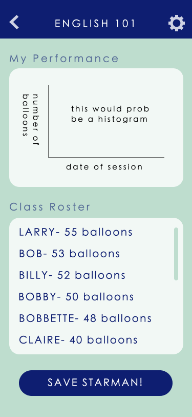 
Students can receive live feedback of their performance through the session screen. 
 

#### Teacher View
Teachers have access to classes they are teaching or have taught through the dashboard. 
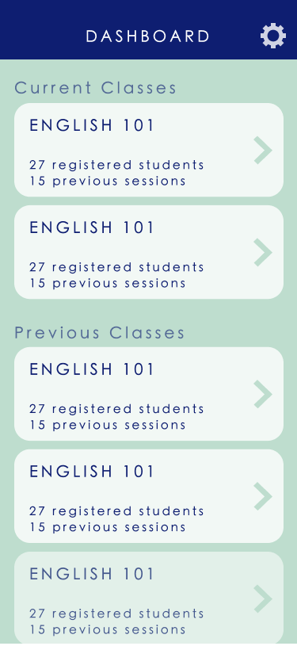 
Teachers can view their classes' performance. 
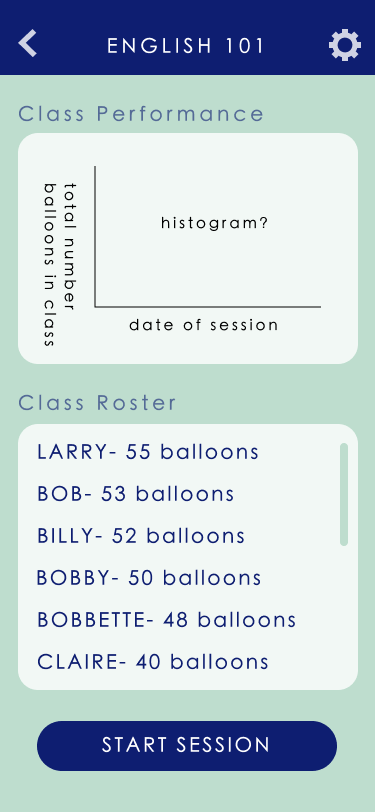 
Teachers have access to their session screen. 
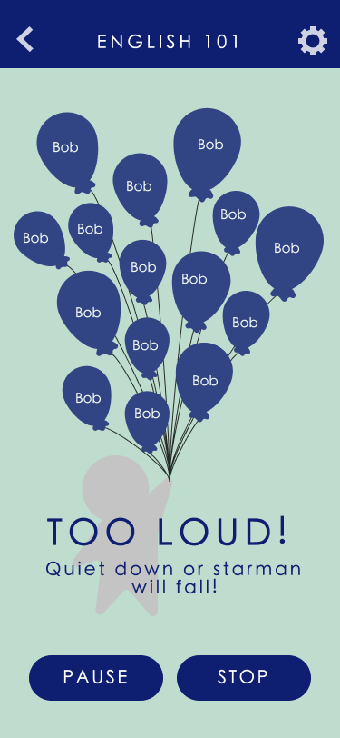 
Taking away balloons in action. 
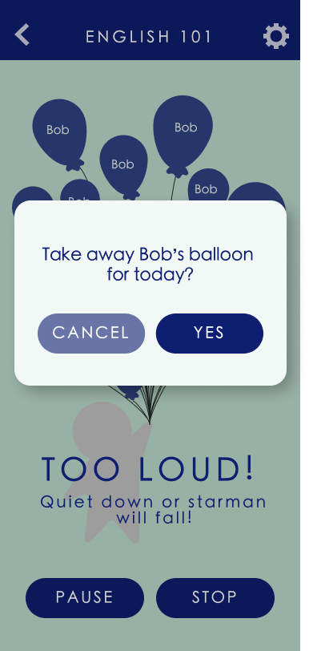 

### UI Skeleton Webpage Screenshots
User is able to sign-in or create an account if they don't have one yet. 

 

User is able to input their account information to access their account. 
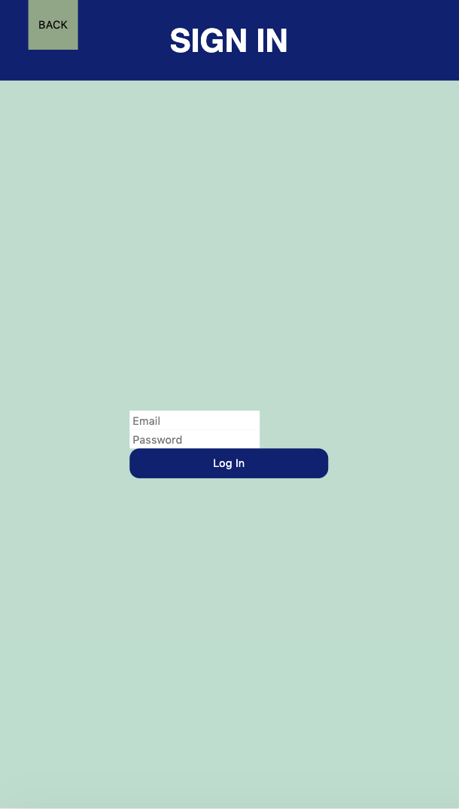 
User is able to create a new account.
Currently, the sign in page leads to the student flow and the create new account page leads to the teacher flow for better visualization. This will be fixed once we are able to determine whether users are teachers or students to display different things on the same html file.  
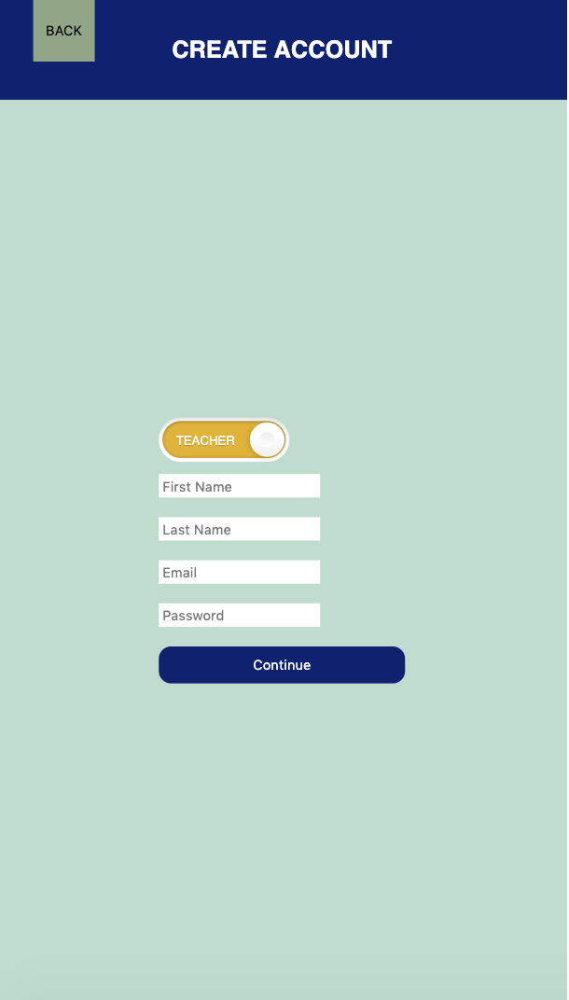 
If user creates a teacher account, a class key will be generated for students to register with. 
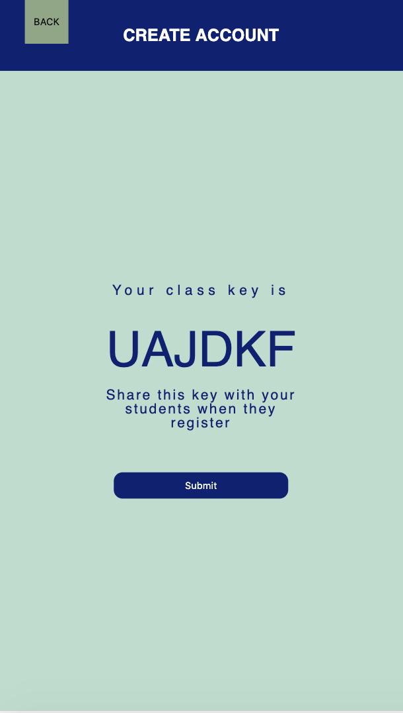 

### Student View
Students have access to current and previous classes through the dashboard. 
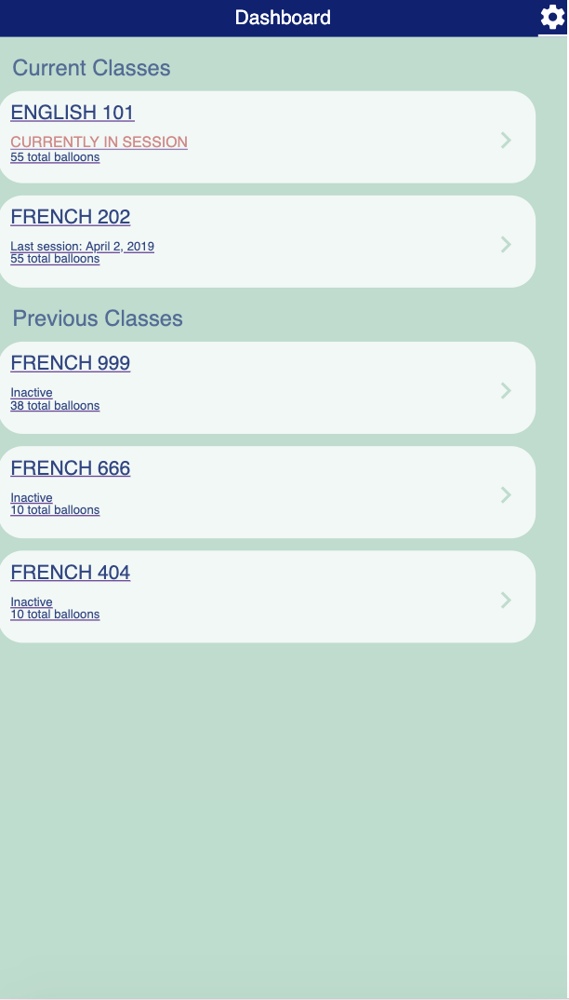 
Students can view their performance in each class and see how their peers are performing in class. 
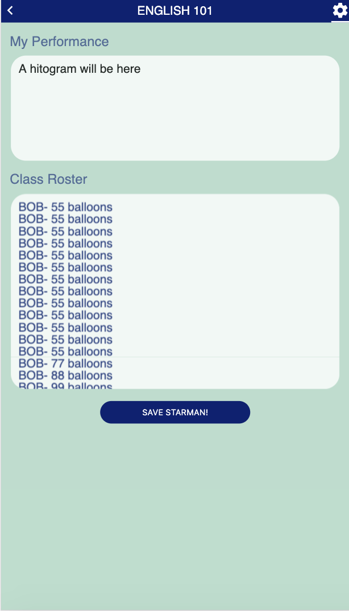 

### Teacher View
Teachers have access to classes they are teaching or have taught through the dashboard. 
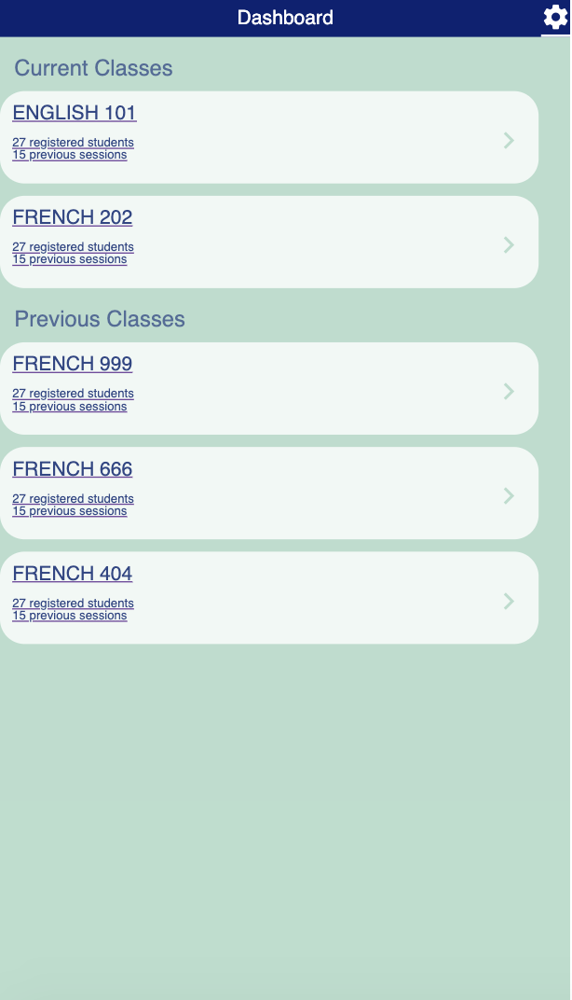 
Teachers can view their classes' performance. 
 

### Shared
Teachers and students both have access to the current session. 
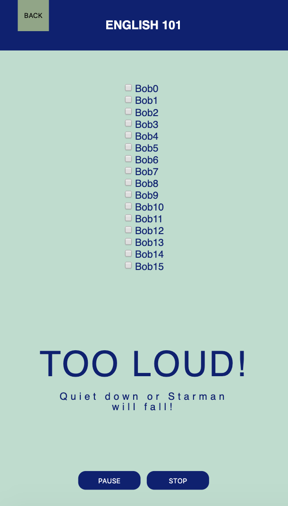 
Temporary settings page. 
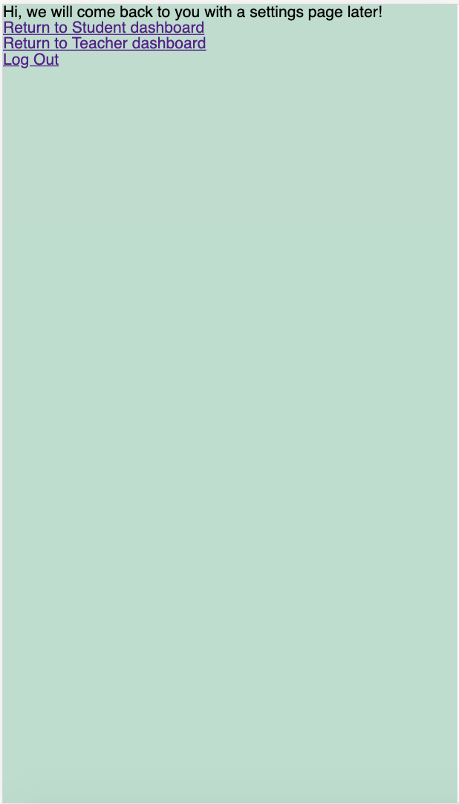 
