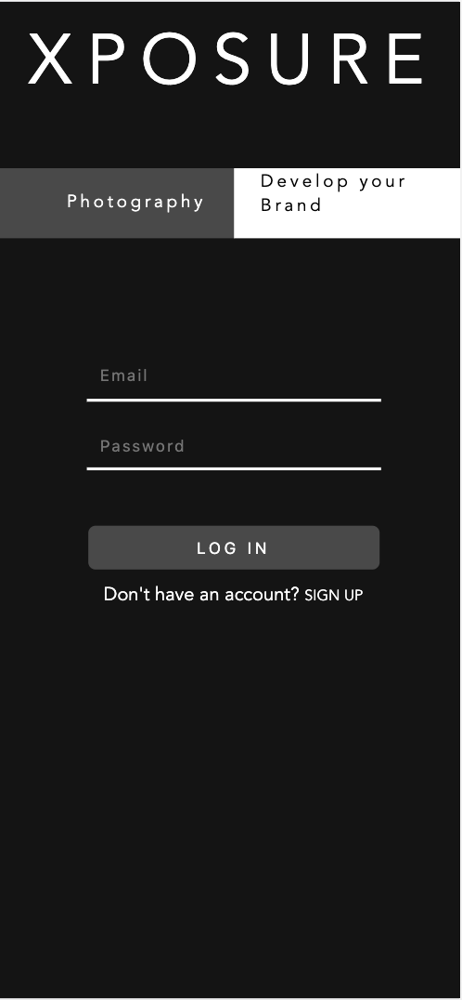
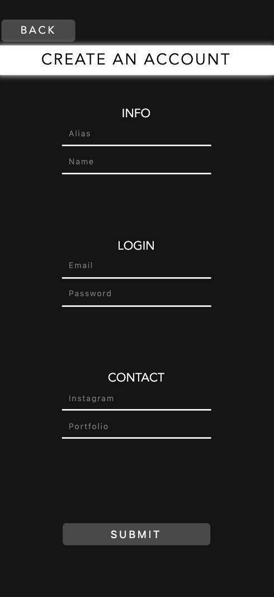
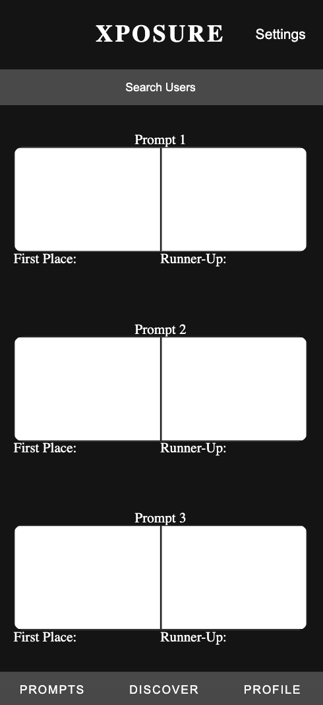
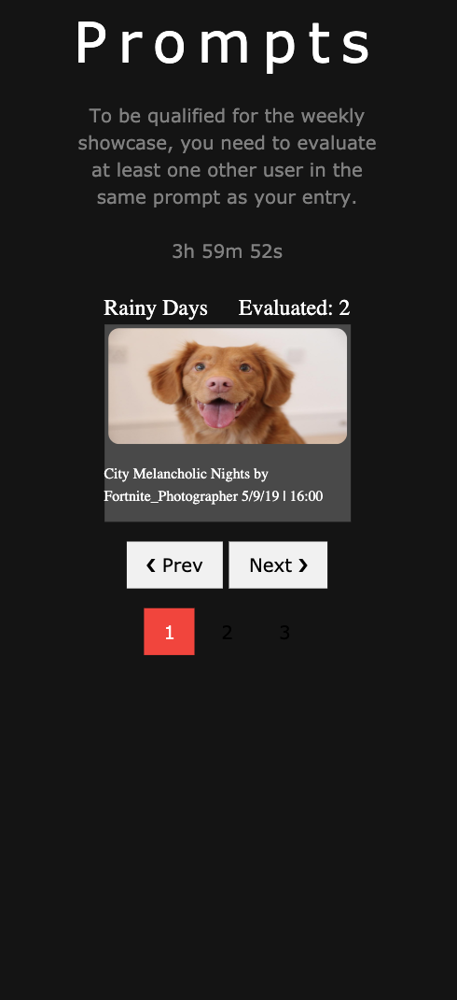
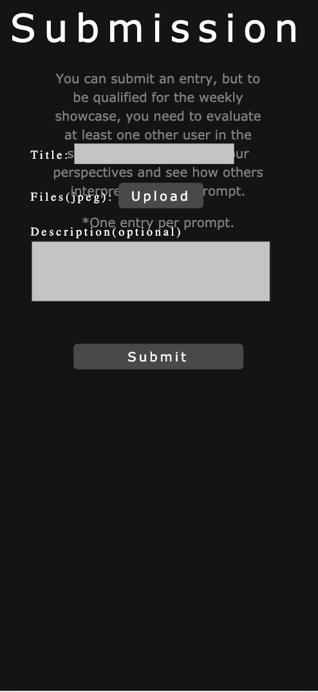
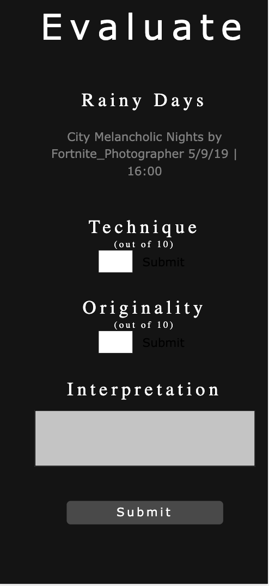
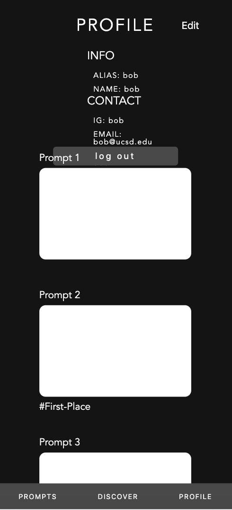
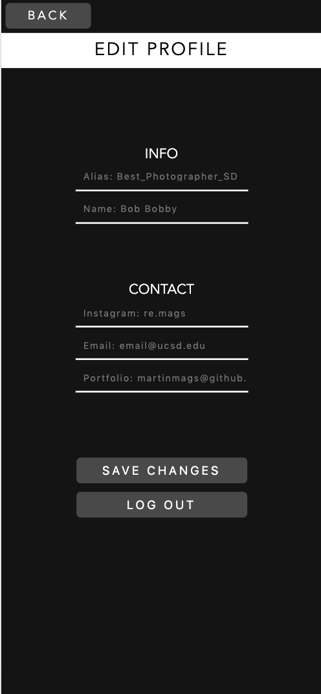
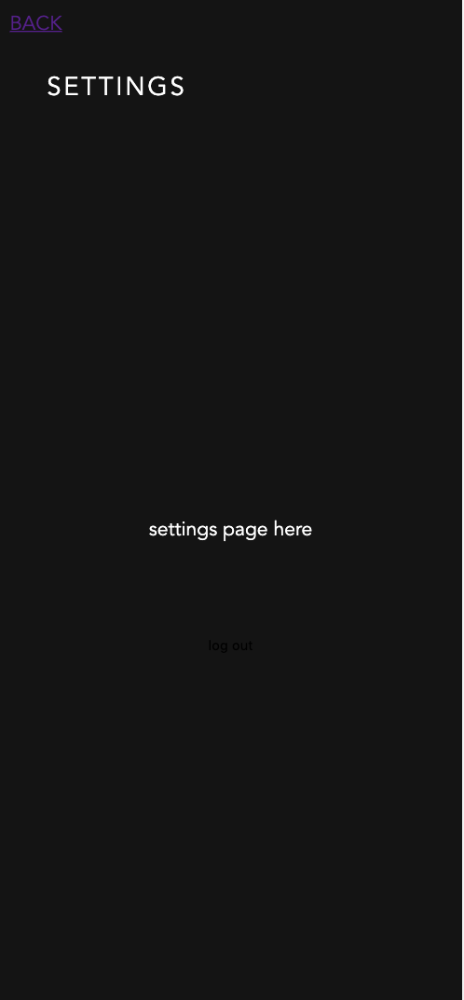

# Milestone 3

#### Table of Contents
1. [Logistics](#Logistics)
3. [New Proposal: Our Idea Changed!](#NewProposal)
   - [UI Skeleton Webpage Screenshots](#Skeleton)

## Logistics
**Team Name**: Panda Express.js 

**Members**:
1. Kai-ling Peng
2. Martin Magsombol
3. Ryan Keng
4. Yidong Luo

**Tech Used**:
* Node.js (backend runtime environment)
* Express (backend framework)
* Firebase (database)
* Unplash API

## New Proposal
**App Name**: *Xposure* 
**Description**:
Xposure is a competitive photography platform that aims to give talented startup photographers the exposure they deserve.

Every week the app selects 3 'collections' from a subset of collections using unsplash's API. Users can submit to these prompts, as well as review entries for each prompt. Reviews are standardized on a set criteria that provides constructive feedback to the photographer.

Submission + Review System
To encourage the whole system of improvement and competition, users that submit must also review another entry in the same prompt in order qualify for the weekly showcase. Reviewing in the same prompt provides the original poster a potentially different perspective or take on the prompt.

At the end of the week, the entry with the best overall review is showcased on the discover screen, and the cycle repeats.

**Target Audience**: *Photographers*

### UI Skeleton Webpage Screenshots
User is able to sign-in or create an account if they don't have one yet. 
 

User is able to create an account. 
 

Users are able to view different finished prompts in the home page. 
 

Users are able to view ongoing prompts. 
 

Users are able to submit their works for each prompt. 
 

Users are able to evaluate other people's works for each prompt. 
 

Users are able to view their account information and submitted works in their profile. 
 

Users are able to edit their account information. 
 

Users are able to change their account settings. 
 
