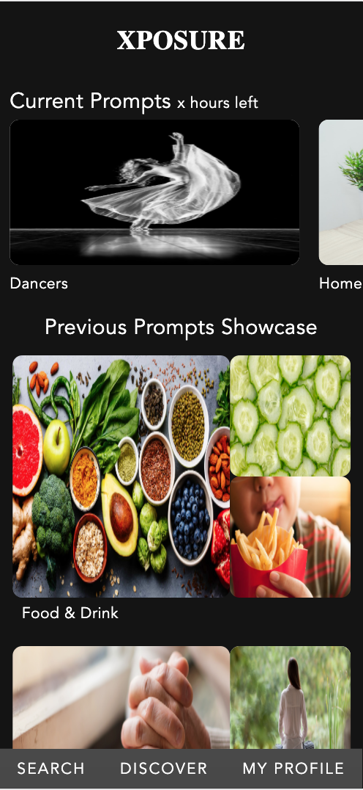
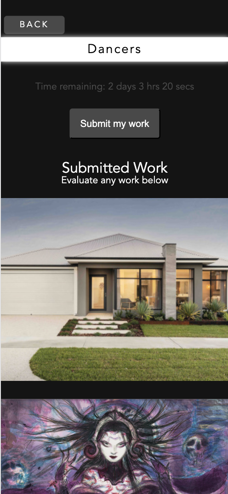
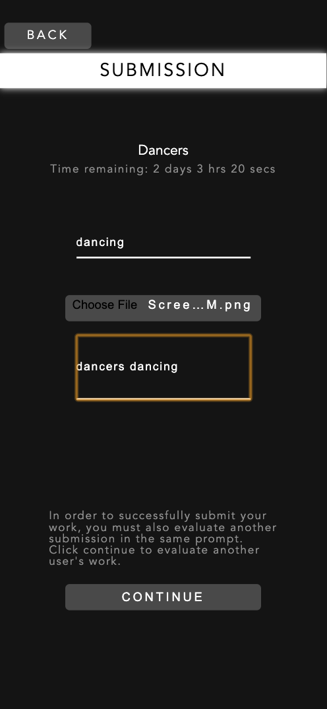
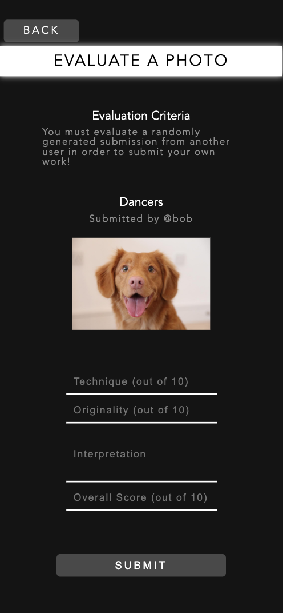
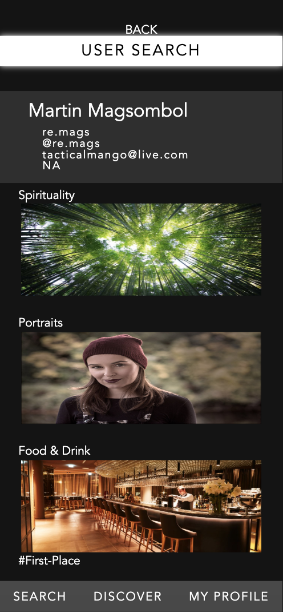
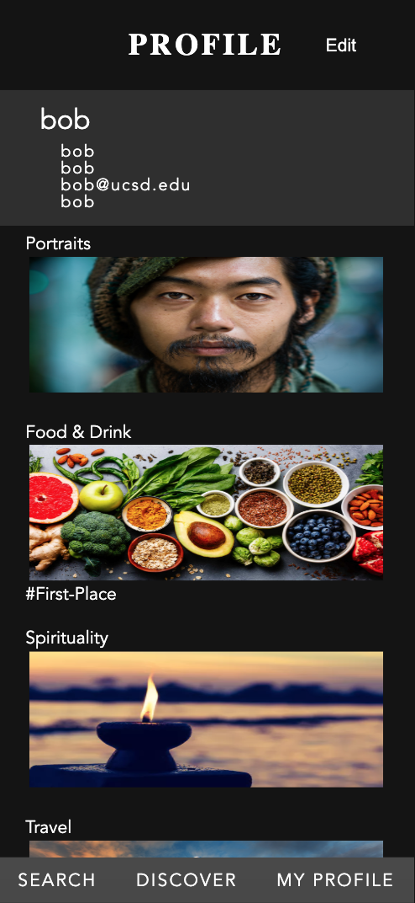
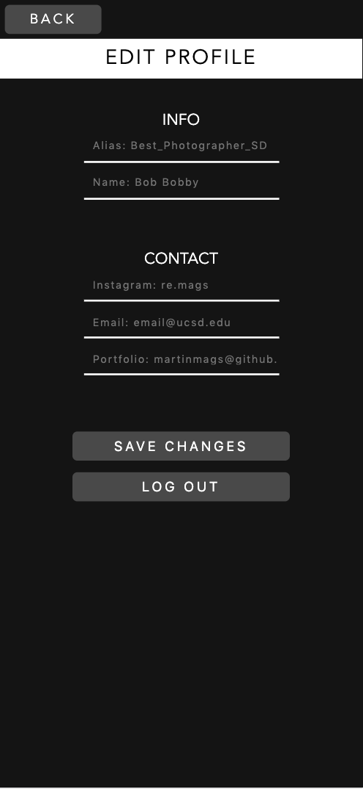

# Milestone 5

#### Table of Contents
1. [Logistics](#Logistics)
2. [Target Users](#TargetUsers)
3. [UI Skeleton Webpage Screenshots](#Skeleton)
4. [Data Visualization](#DataVisualization)

## Logistics
**Team Name**: Panda Express.js 

**Members**:
1. Kai-ling Peng
2. Martin Magsombol
3. Ryan Keng
4. Yidong Luo

## Target Users
Our target user population consists of entry-level photographers who wish to gain experience as well as exposure. It's hard for entry-level photographers to gain much exposure especially when they have just started photography. Our app provides a platform for employers to discover new and talented photographers through a competitive photography platform. Every week, new prompts are generated for photographers to submit entries, as well as review other submissions. At the end of the week, winners are calculated based on overall reviews and links to their profiles are displayed in a showcase. In using Xposure, entry-level photographers are able to practice their craft by taking more pictures every week to submit to new prompts while having the chance of being featured for their winning works, allowing employers to easily discover these photographers.

### UI Skeleton Webpage Screenshots
In milestone 5, our screenshots are different from milestone 4's because most of our data is now being displayed in the front-end. In milestone 4, we had focused on back-end processes and other functionality. This week, however, we were able to render the images and user information to display in the front end. We also added a third screen stack: Searching for user profiles.

User is able to sign-in or create an account if they don't have one yet. 
 

User is able to create an account if they don't have one yet. 
 

Users are able to view different ongoing and finished prompts in the home page. 
 

Users are able to view ongoing prompts and their submitted works. 
 

Users are able to submit their works for each prompt. 
 

Users are able to evaluate other people's works for each prompt. 
 

Users are able to search for other profiles. 
 

Users are able to access other users' profiles. 
 

Users are able to view their own account information and submitted works in their profile. 
 

Users are able to edit their account information. 
 

### Data Visualization

We set up Firebase on both the front-end and the back-end. In the front-end, we fetch data from Firebase Firestore and display them, i.e. dynamically populating HTML content with data filled in. We don’t have fancy techniques for displaying data. We simply fill the src attribute in the  when data is successfully fetched. Fetching the image download URL from the Firebase Storage bucket will be elaborated in the next paragraph.

On the other hand, in the back-end, we handle user input and write them into Firebase Firestore collections. For regular user input that involves text or numbers, we can handle them just fine using ExpressJS. However, when it comes to handling file uploads, we adapted the Busboy library to parse multipart data, as it is recommended in the Google Cloud Functions documentation. This way, we are able to process file uploads and store files into our Firebase Storage bucket. If the front-end were to fetch the uploaded image’s download URL, we must target the Firestore document that holds the path to the uploaded image. Once the storage path is obtained, we can use a Firebase Storage function call: `storageRef.child(path).getDownloadURL()` to retrieve the public URL the image is hosted on.

To visualize our data, users are able to view their own submissions and profile information in the profile page.
 

They are also able to view submissions from other people for every prompt.
 

Users are able to see winning submissions for every finished prompt and the winners' user profiles.
 

 

Going forward from here, we hope to visualize data from each user profile in a better way and allow for more user control. We could add more profile functions from within the edit profile page and allow users to sort through their previous submissions. We could analyze user performance over time, taking into account the scores of each work they've submitted and how many submissions were made. The resulting graph could be shown in their profile pages as well.
