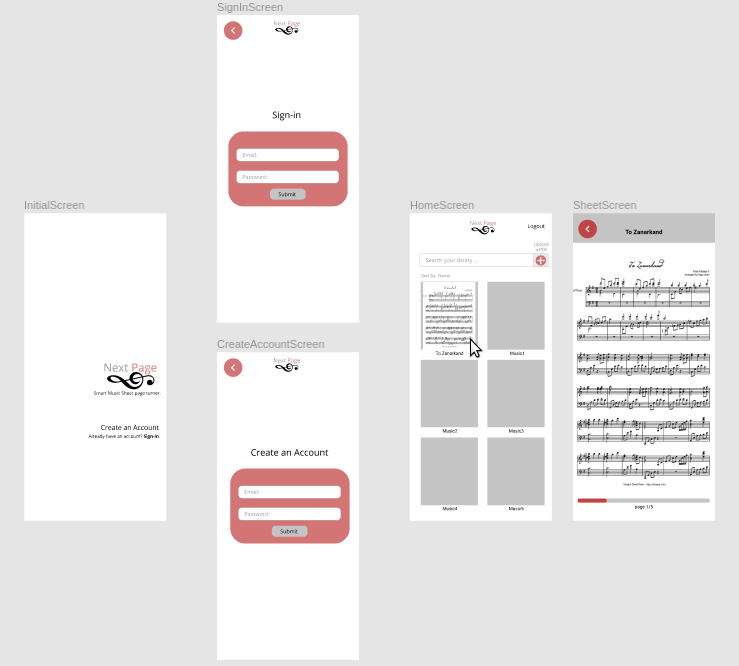
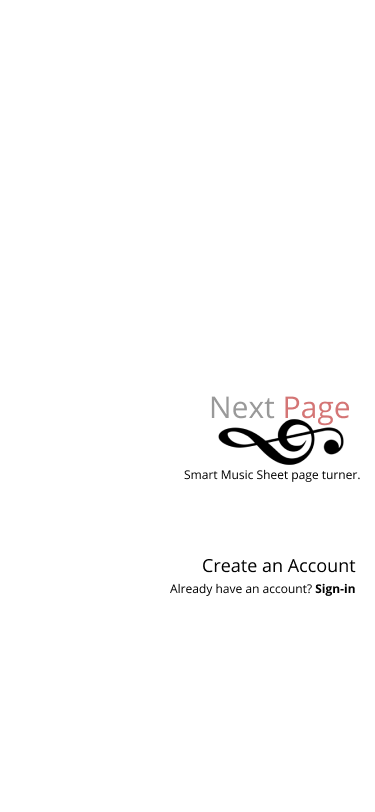
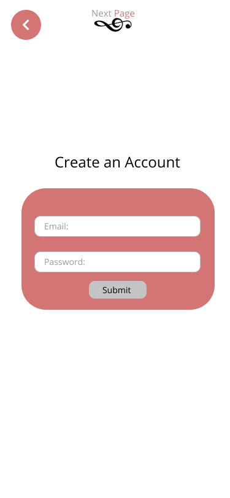
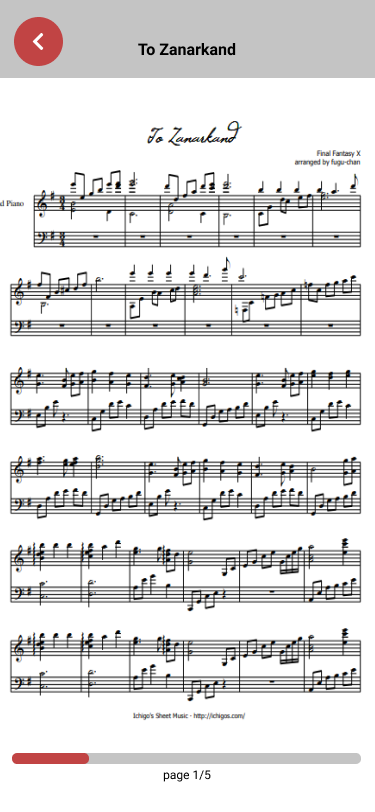
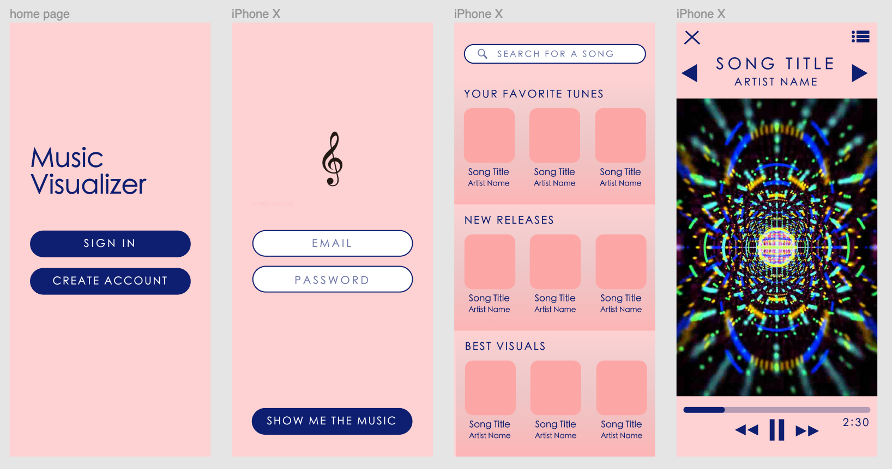
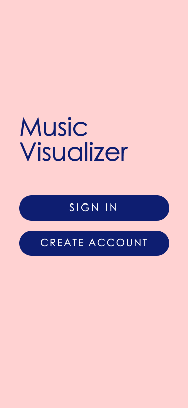
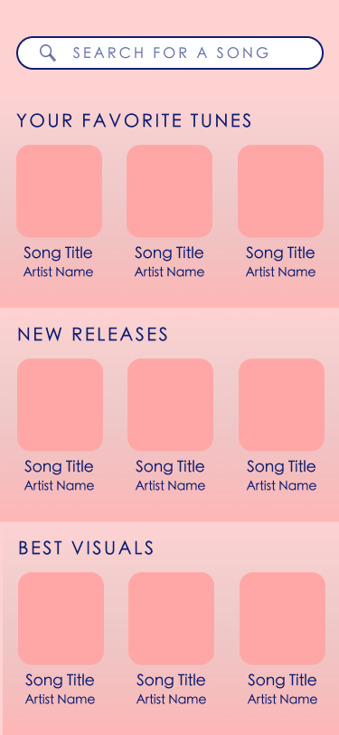

# Milestone 1
#### Table of Contents
1. [Logistics](#Logistics)
2. [Proposal 1: Next Page](#Proposal1)
3. [Proposal 2: Music Visualizer](#Proposal2)
   

<a name="Logistics"/>

## Logistics
**Team Name**: Panda Express.js 

**Members**:
1. Kai-ling Peng
2. Martin Magsombol
3. Ryan Keng
4. Yidong Luo

**(Tentative) Tech**: 
* Node.js (backend runtime environment)
* Express (backend framework)
* SQLite (database)
* jQuery or React (frontend framework)
   

<a name="Proposal1"/>

## Proposal 1
**App Name**: *Next Page* 
**Inspiration**:  Saw at church that the pianist would occasionally have another musician turn the page.  
**Description**
>Web App/Mobile Web App that accesses the devices' microphone, takes a PDF of a music sheet (or multiple PDFs), creates a decider on when to flip the page, and once the user triggers the unique signal then the music sheet automatically turns the page.
>
**Target Audience**: *Musicians that consistently practice and perform.*
> We appreciate music and some of us have an understanding of how to play an instrument, but collectively, we do not consider ourselves as musicians.
>
> **Martin**: Played trumpet, mainly to keep my parents happy and get some scholarships; has not played in a year.
>
> **Ryan**: Played flute, and now, has no idea where it is.
>
> **Kai-ling**: Is jealous of her musical friends.
>
> **Roy**:Played saxophone, mainly to keep my parents happy and get some scholarship; has not played in 5 years. (I may have shared parents with Martin.)
>
**Sources (API or Datasets)**:

API that detects pitches:
[Pitch Detection API](https://github.com/cwilso/pitchdetect?fbclid=IwAR0N7MI8QKc3qZUyRXYhVFUjvFprRBH4w4GODq_7Rs2JzL2nEEwvTcPmJSc) 
APIs that recognize musical sheets:
[Overscore](https://github.com/acieroid/overscore), [SheetVision](https://github.com/cal-pratt/SheetVision) 
API that allows you to upload files:
[Google Drive API](https://developers.google.com/drive/api/v3/manage-uploads) 
API that embeds music notes on the browser (html):
[Music Notes Embedding](https://flat.io/developers/embed/generator) 

#### Storyboard 1
 

#### Prototype 1
  
User is able to sign-in or create an account if they don't have one yet. 
 
User is able to create an account. 
 
User is able to sign-in if they have an account already. 
 
User is able to upload/search pdfs of music sheets as well as choose music sheets to start practicing/performing. 
 
User is able to practice/perform handsfree using the app's automatic page turner. 

   

<a name="Proposal2"/> 

## Proposal 2
**App Name**: *Music Visualizer* 
**Inspiration**:  Wondered what it would be like to be at a rave without hearing anything. Would the experience be that different? 
**Description**
>Web App/Mobile Web App that is almost like a Spotify for the deaf or hard of hearing. It visualizes music tracks and syncs vibrations to the beat of the music to transform the act of hearing into a visual and somatosensory experience.
>
**Target Audience**: *The deaf and hard of hearing community.*
> We are all lucky enough to be able to hear, and we empathize with the deaf community.
>
**Sources (API or Datasets)**:

List of audio visualization APIs:
[awesome-audio-visualization](https://github.com/willianjusten/awesome-audio-visualization) 
API that provdies physical feedback to the user by causing the device to shake:
[Vibration API](https://developer.mozilla.org/en-US/docs/Web/API/Vibration_API) 

#### Storyboard 1
 

#### Prototype 1
  
User is able to sign-in or create an account if they don't have one yet. 
 
User is able to input their account information to access/create an account. 
 
User is able to search/discover songs. 
 
User is able to experience the visuals and vibrations. 

